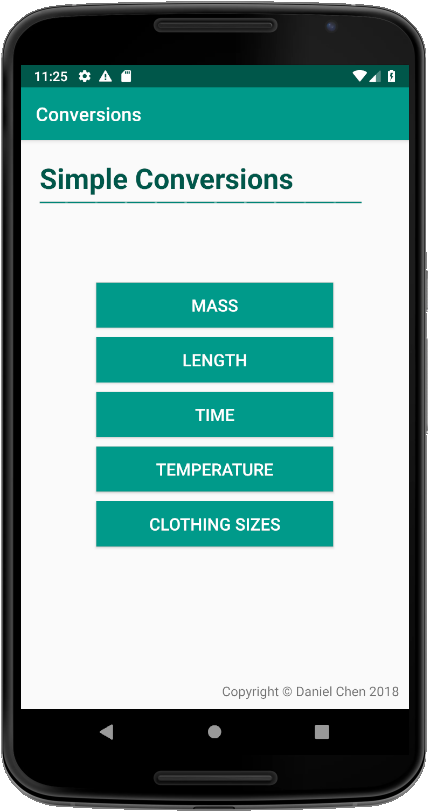
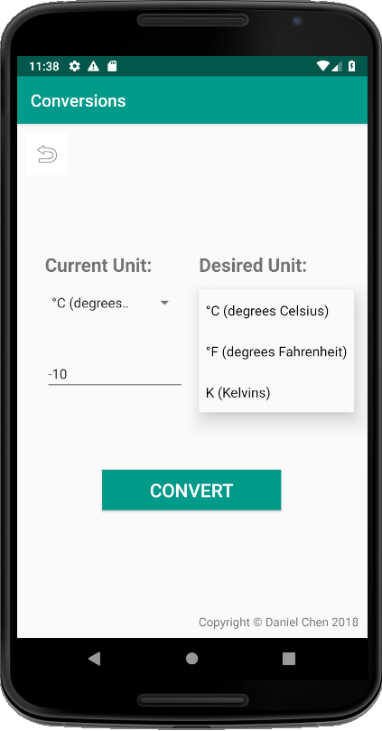

# Conversions App
A conversion app between units made with Java in Android Studio

## Screenshots

## Tools Used
Java, Android Studio

## Functionality
- Allows the user to do easy conversions in a very light and simple-to-use setting.
- Currently can convert:
  1. Mass
  2. Length
  3. Time
  4. Temperatures
  5. Clothing sizes

#### To Do
- [x] Improve decimal formatting
- [x] Add functionality for clothing sizes  
- [x] Include option to swap values from left to right  
- [ ] Improve user interface  

## Project
Made in Dec 2018
